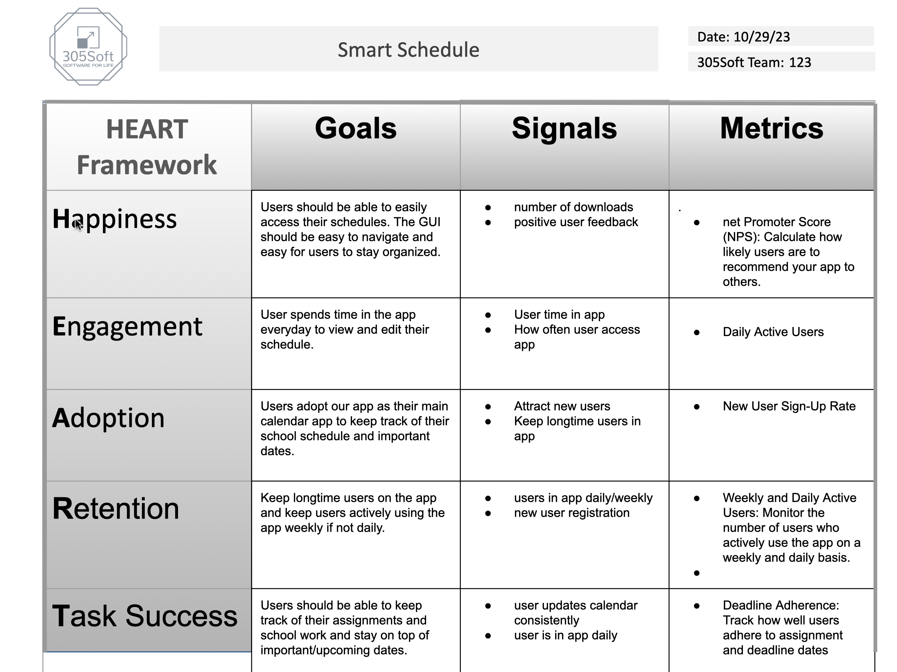

# SmartSchedule App Metric Collection

## Happiness:

- **User Surveys:** Periodically gather user feedback on satisfaction, ease of use, and features.
- **App Store Reviews:** Monitor and analyze user ratings and comments.

## Engagement:
- **Collecting Metrics:**
    1. Firebase Analytics and backend data : Implement Firebase Analytics within the SmartSchedule app to automatically track user engagement. Set up data collection in the        Firebase backend to capture user activity, specifically tracking user logins and interactions within the app.
    2. Daily Tracked Events: Employ event tracking within Firebase Analytics to log daily app opens or any user interactions as an active user.
    3.Retrieve Data: Retrieve daily active user counts by querying the Firebase backend data to obtain the number of unique users who actively engage with the app on a            daily basis.

- This process involves the combination of Firebase Analytics for real-time user engagement tracking within the app and utilizing the Firebase backend to process and retrieve the data that indicates daily active user counts.
    

## Adoption:
- **Collecting Metrics:**
    1. New User Registration Rate: Use Google Analytics or Firebase Analytics to track the number of new users who sign up for your app
    2. Onboarding Completion Rate: Use Google Analytics or Firebase Analytics to track the number of users who complete the onboarding process.
    3. First Assignment Added Rate: Use Google Analytics or Firebase Analytics to track the number of users who add their first assignment.

## Retention:
- **Collecting Metrics**
    1. Churn & Retention Rate: We will utilize Google Analytics and Firebase to track user engagement and login frequency, enabling us to calculate churn rate and retention rate for both control (Group A) and experimental (Group B) users.
    2. Push Notification Click-Through Rate: To measure push notification click-through rate, we will integrate Firebase Cloud Messaging (FCM) with Firebase Analytics. This integration will allow us to track the delivery and engagement of push notifications in both groups.

## Task Success:
- **Collecting Metrics:**
Method: Utilize Firebase backend data and internal app analytics

    1. Google Analytics Event Tracking: Implement event tracking in Google Analytics to monitor user behaviors related to assignment completion close to or after deadlines.
    2. Push Notifications and Reminders: Use Firebase Cloud Messaging to send reminders or notifications to users close to or after assignment deadlines, monitoring their         response and subsequent completion.

-By tracking assignment completion timestamps, using Google Analytics for event tracking, and employing reminders through Firebase Cloud Messaging, the SmartSchedule app can gauge how well users adhere to assignment deadlines.

